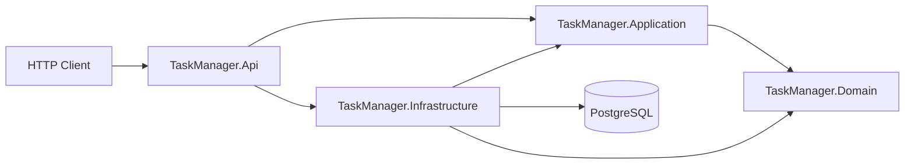
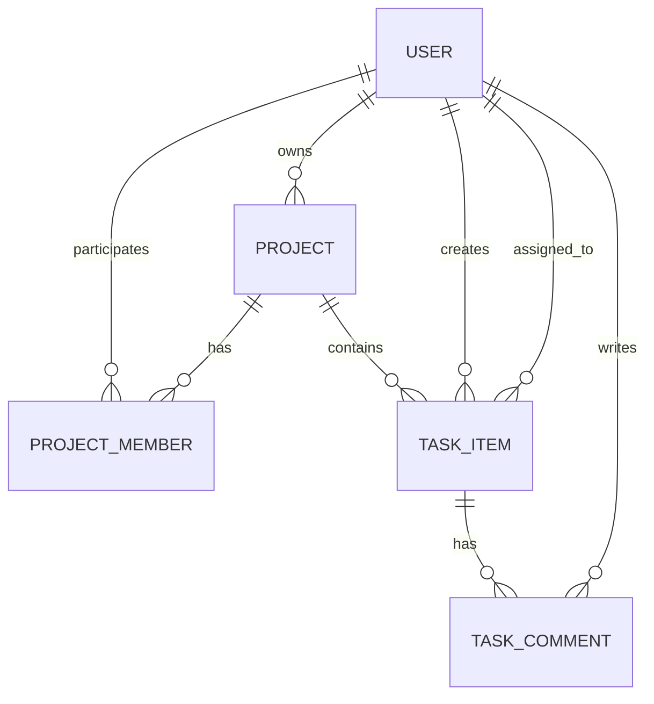
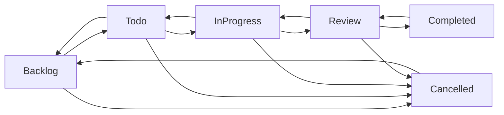

# TaskManager API

A production-oriented **ASP.NET Core / .NET 10** backend portfolio project for collaborative project and task management.

The repository focuses on practical backend engineering: clear architecture boundaries, domain modeling, authentication and authorization, PostgreSQL persistence, testability, and explicit engineering trade-offs without adding distributed-system complexity that the problem does not require.

## Current status

The core backend is implemented and covered by unit and PostgreSQL integration tests.

Implemented today:

- user registration and login;
- JWT bearer authentication;
- projects with archive / restore lifecycle;
- project members and roles;
- task creation, update, assignment, unassignment, and status workflow;
- task comments with soft delete;
- resource-level authorization;
- ProblemDetails-based error responses;
- separate liveness and PostgreSQL-backed readiness probes;
- structured request logging with correlation and W3C trace identifiers;
- OpenTelemetry HTTP tracing, ASP.NET Core metrics, runtime metrics, and optional OTLP export;
- EF Core migrations;
- PostgreSQL persistence;
- Testcontainers-based integration tests;
- Docker multi-stage build;
- Docker Compose local environment with PostgreSQL and automatic migrations;
- GitHub Actions CI for restore, Release build, unit tests, and PostgreSQL integration tests;
- API integration test infrastructure using `WebApplicationFactory<Program>` and PostgreSQL Testcontainers;
- bounded database-side pagination for project, member, task, and comment collections;
- task filtering, search, and deterministic sorting;
- nullable reference types, analyzers, code-style checks, and warnings as errors.

Production-readiness work is intentionally incremental. API-level integration tests, bounded querying, optimistic concurrency, health checks, consistency handling, structured logging, and OpenTelemetry instrumentation are implemented. Rate limiting and the final security/performance/design review remain roadmap work.

---

## Tech stack

- **.NET 10 / ASP.NET Core Web API**
- **C#**
- **Entity Framework Core 10**
- **PostgreSQL**
- **Npgsql**
- **JWT Bearer Authentication**
- **ASP.NET Core Identity PasswordHasher**
- **xUnit**
- **NSubstitute**
- **Testcontainers for PostgreSQL**
- **Docker / Docker Compose**
- **GitHub Actions**
- **Microsoft.Testing.Platform**
- **OpenAPI**
- **OpenTelemetry / OTLP**

---

## Architecture

The solution uses a layered, Clean Architecture-inspired modular monolith.



### Dependency direction

**TaskManager.Domain**

Contains the business model and domain invariants. It has no dependency on ASP.NET Core, EF Core, or infrastructure concerns.

**TaskManager.Application**

Contains use cases, commands, queries, handlers, authorization policies, and abstractions such as repositories, `IUnitOfWork`, `ICurrentUser`, and `IClock`.

**TaskManager.Infrastructure**

Implements persistence, EF Core mappings, repositories, JWT creation, password hashing, and system time.

**TaskManager.Api**

Contains controllers, HTTP contracts, authentication setup, OpenAPI configuration, and global exception handling.

The goal is dependency inversion without introducing framework-heavy indirection where it is not needed.

---

## Solution structure

```text
TaskManagerApi/
├── Dockerfile
├── compose.yaml
├── .dockerignore
├── .env.example
├── .github/
│   └── workflows/
│       └── ci.yml
│
├── TaskManager.Api/
│   ├── Authentication/
│   ├── Contracts/
│   ├── Controllers/
│   ├── ErrorHandling/
│   └── Program.cs
│
├── TaskManager.Application/
│   ├── Abstractions/
│   ├── Common/
│   ├── Projects/
│   ├── Tasks/
│   ├── TaskComments/
│   └── Users/
│
├── TaskManager.Domain/
│   ├── Entities/
│   ├── Enums/
│   └── Exceptions/
│
├── TaskManager.Infrastructure/
│   ├── Persistence/
│   │   ├── Configurations/
│   │   ├── Migrations/
│   │   └── Repositories/
│   ├── Security/
│   └── Time/
│
└── tests/
    ├── TaskManager.Domain.UnitTests/
    ├── TaskManager.Application.UnitTests/
    ├── TaskManager.Infrastructure.IntegrationTests/
    └── TaskManager.Api.IntegrationTests/
```

---

## Domain model



### Main entities

#### User

A user has a normalized unique email, display name, password hash, active state, and audit timestamps.

Passwords are never stored directly. Password hashing is delegated to ASP.NET Core Identity's `PasswordHasher`.

#### Project

A project has an owner, name, optional description, lifecycle timestamps, and an archived state.

Archived projects are intentionally read-only for the mutation flows that operate inside the project.

#### ProjectMember

A project member connects a user to a project with a role.

Current roles are used by application authorization policies. Membership removal is represented by `RemovedAtUtc`, allowing membership history to be preserved and restored.

The database enforces uniqueness for:

```text
(project_id, user_id)
```

#### TaskItem

A task belongs to one project and contains:

- creator;
- optional assignee;
- title and description;
- priority;
- status;
- optional due date;
- creation/update/completion timestamps.

Task status changes are protected by domain invariants instead of being treated as arbitrary enum replacement.

The workflow is:



Completed and cancelled tasks cannot be modified through ordinary task mutation methods until their status returns to a modifiable state.

#### TaskComment

Comments belong to tasks and have an author, content, and audit timestamps.

Deletion is a soft delete via `DeletedAtUtc`. Deleted comments are excluded from normal comment list queries.

---

## CQRS-style application layer

The application layer separates commands and queries through small interfaces:

```csharp
ICommandHandler<TCommand, TResult>
IQueryHandler<TQuery, TResult>
```

This keeps use cases explicit without introducing MediatR solely for indirection.

Examples of commands:

- create/update/archive/restore project;
- add/remove/change role of project member;
- create/update/assign/unassign/change status of task;
- add/edit/delete task comment;
- register/login user.

Examples of queries:

- get project by id;
- list accessible projects;
- list project members;
- get task by id;
- list project tasks;
- list task comments.

---

## Authentication

Authentication uses JWT bearer tokens.

JWT validation includes:

- issuer validation;
- audience validation;
- signing key validation;
- token lifetime validation;
- a small clock skew;
- subject (`sub`) claim mapped to the authenticated user id.

The default access-token lifetime is **15 minutes**.

The JWT signing key is intentionally not committed to `appsettings.json`.

### Login behavior

Login returns the same generic error for an unknown user, inactive user, or invalid password:

```text
Invalid email or password.
```

This avoids exposing whether a particular email address is registered.

---

## Authorization

Authorization is enforced at both HTTP and application levels.

Protected controllers use `[Authorize]`, while resource-level rules are implemented in application policies and handlers.

### Project access

- the project owner has access;
- an active project member has access;
- a removed member or outsider receives `404 Not Found`.

Returning 404 for inaccessible projects reduces resource-enumeration / IDOR information leakage.

### Member management

Project members can be managed by:

- the project owner;
- an active member with the `Manager` role.

An active non-manager receives `403 Forbidden`.

### Project lifecycle

Only the project owner can:

- update project details;
- archive the project;
- restore the project.

### Archived projects

Archived projects remain readable, but mutation operations such as task changes, comment changes, and member-management changes are rejected.

### Comment permissions

- comment author can edit the comment;
- comment author or project owner can delete it;
- deleted comments are not returned by normal list queries.

---

## Persistence and database

Persistence is implemented with EF Core and PostgreSQL.

### Repository approach

The application depends on repository abstractions rather than directly on `DbContext`.

The repository layer intentionally distinguishes read and mutation behavior where needed. For example, project reads can use `AsNoTracking`, while update flows use a tracked query.

### Unit of Work

`AppDbContext` implements `IUnitOfWork`.

A use case performs its entity changes and normally calls a single:

```csharp
SaveChangesAsync(cancellationToken)
```

For multi-write operations inside one `SaveChanges`, EF Core already provides the required transaction boundary. Explicit transactions are therefore not added automatically when they do not solve an actual consistency problem.

### Constraints and indexes

The model includes database-level protection such as:

- unique normalized user email;
- unique `(project_id, user_id)` project membership;
- foreign keys for ownership, membership, tasks, assignees, and comments;
- indexes for common relationship lookups;
- restrictive delete behavior for important relationships.

Database constraints are treated as the final consistency boundary; application validation alone is not considered sufficient.

---

## Error handling

The API uses a global ASP.NET Core exception handler and ProblemDetails.

Application/domain exceptions are translated to HTTP semantics such as:

- `400 Bad Request` — validation error;
- `401 Unauthorized` — authentication failure;
- `403 Forbidden` — authenticated but insufficient permissions;
- `404 Not Found` — resource absent or intentionally hidden by access policy;
- `409 Conflict` — business-state conflict;
- `500 Internal Server Error` — unexpected failure.

Unexpected exceptions are logged, while clients receive a generic 500 detail.

ProblemDetails responses include a `traceId` to support diagnostics.

---

## Testing strategy

The test suite is split by responsibility instead of testing every rule at every layer.

### Domain unit tests

Verify entity invariants and domain behavior, including task lifecycle rules.

Project:

```text
tests/TaskManager.Domain.UnitTests
```

### Application unit tests

Verify use cases, authorization behavior, error semantics, repository interactions, and edge cases using NSubstitute.

Project:

```text
tests/TaskManager.Application.UnitTests
```

### PostgreSQL integration tests

Persistence tests run against a real PostgreSQL instance started by Testcontainers.

The current fixture uses:

```text
postgres:17-alpine
```

These tests validate mappings, migrations, repository behavior, database constraints, and persistence-specific behavior rather than relying on EF Core's in-memory provider.

Project:

```text
tests/TaskManager.Infrastructure.IntegrationTests
```

### API integration tests

A dedicated API integration test project uses `WebApplicationFactory<Program>` together with a real PostgreSQL Testcontainer.

Project:

```text
tests/TaskManager.Api.IntegrationTests
```

Current coverage verifies:

- the API can boot through the real ASP.NET Core pipeline;
- the public ping endpoint returns `200 OK`;
- a protected endpoint returns `401 Unauthorized` without a token;
- register → login → authenticated profile;
- project creation and persisted read-back;
- project archive → persisted archived state → restore;
- member add → role promotion → manager-driven member removal;
- regular-member member-management rejection with `403 Forbidden`;
- removed-member and outsider anti-enumeration behavior with `404 Not Found`;
- task creation and persisted read-back;
- task assignment and unassignment with persisted assignee state;
- the full valid task status path from `Backlog` to `Completed`, including persisted completion state;
- comment create → author edit → project-owner delete → soft-delete exclusion from list results;
- archived-project mutation rejection with `409 Conflict`;
- domain validation mapped to `400 Bad Request`;
- ProblemDetails status/title/detail/instance/trace-id semantics for representative 400/403/404/409 responses;
- concurrent duplicate registration resolves to one successful create and one `409 Conflict` rather than a `500`;
- request correlation is returned to clients and preserved when a valid `X-Correlation-ID` is supplied;
- W3C `traceparent` propagation is preserved into ProblemDetails trace identifiers.

These scenarios execute through HTTP, JWT authentication, authorization policies, controllers, application handlers, EF Core, and PostgreSQL.

The fixture applies real EF Core migrations before the test server is created and provides a database reset hook for isolated scenario tests.

Additional edge-case API scenarios can be added as regressions are discovered, but the main authentication, collaboration, authorization, lifecycle, persistence, and error-semantics paths now have HTTP-level coverage.

---

## Build quality

Repository-wide build settings include:

```xml
<Nullable>enable</Nullable>
<TreatWarningsAsErrors>true</TreatWarningsAsErrors>
<AnalysisLevel>latest-recommended</AnalysisLevel>
<EnforceCodeStyleInBuild>true</EnforceCodeStyleInBuild>
<Deterministic>true</Deterministic>
```

This makes compiler warnings and analyzer findings part of the normal quality gate.

### Continuous Integration

GitHub Actions runs CI on:

- pushes to `main`;
- pull requests targeting `main`.

The workflow performs:

```text
checkout
   ↓
setup .NET 10
   ↓
dotnet restore
   ↓
dotnet build --configuration Release
   ↓
dotnet test --configuration Release
```

The test step runs the complete solution test suite, including PostgreSQL integration tests. Those tests use Testcontainers, so the GitHub-hosted Linux runner starts a real PostgreSQL container during CI.

The workflow deliberately builds once and then runs tests with `--no-build --no-restore`. This keeps the pipeline explicit and avoids silently rebuilding the solution during the test stage.

Warnings remain errors in CI because the same repository-wide `Directory.Build.props` settings apply to the Release build.

Concurrent runs for the same Git ref are cancelled when a newer run starts, which avoids wasting CI time on superseded commits.

---

## Local development

### Recommended: Docker Compose

The quickest way to start the complete local environment is Docker Compose.

Prerequisite:

- Docker Desktop or another Docker-compatible runtime with Compose support.

Clone the repository and start the stack:

```bash
git clone https://github.com/Sergiy2k1/TaskManagerApi.git
cd TaskManagerApi
docker compose up
```

On the first run Docker builds the application image, starts PostgreSQL, waits for the database health check, applies EF Core migrations through the one-shot `migrate` service, and only then starts the API.

The API is available at:

```text
http://localhost:5135
```

OpenAPI in the Compose development environment:

```text
http://localhost:5135/openapi/v1.json
```

The Compose stack contains three services:

- `postgres` — PostgreSQL 17 with a persistent named volume and `pg_isready` health check;
- `migrate` — one-shot EF Core migration runner that waits for PostgreSQL readiness;
- `api` — the published ASP.NET Core application, which starts only after migrations complete successfully.

Stop the stack:

```bash
docker compose down
```

Stop it and delete the local PostgreSQL volume:

```bash
docker compose down -v
```

Docker Compose includes local-development defaults so `docker compose up` works without creating an `.env` file. To customize ports, PostgreSQL credentials, or JWT configuration, copy:

```bash
cp .env.example .env
```

On PowerShell:

```powershell
Copy-Item .env.example .env
```

The default credentials and JWT key are explicitly development-only and must not be reused in a deployed environment.

### Docker build design

The `Dockerfile` uses a multi-stage build:

1. **build** — uses the full .NET SDK to restore tools/packages and publish the API;
2. **migrations** — reuses the SDK build stage only for the one-shot `dotnet ef database update` Compose service;
3. **final** — uses the smaller ASP.NET Core runtime image and copies only published output.

This keeps SDK tooling and source code out of the runtime API image. The API also runs as the non-root user provided by the official .NET image.

Project files are copied before the rest of the source so Docker can reuse the NuGet restore layer when application code changes but dependencies do not.

### Manual local setup

If you prefer to run the API directly from the .NET SDK instead of Docker Compose, use the following setup.

#### Prerequisites

- .NET 10 SDK;
- PostgreSQL.

For running PostgreSQL integration tests:

- Docker-compatible container runtime, because Testcontainers starts PostgreSQL automatically.

### 1. Clone the repository

```bash
git clone https://github.com/Sergiy2k1/TaskManagerApi.git
cd TaskManagerApi
```

### 2. Restore dependencies and tools

```bash
dotnet restore
dotnet tool restore
```

### 3. Configure PostgreSQL

Create a local database, for example:

```text
Database: task_manager
User:     postgres
Port:     5432
```

Store the connection string with .NET user secrets:

```bash
dotnet user-secrets set "ConnectionStrings:Database" "Host=localhost;Port=5432;Database=task_manager;Username=postgres;Password=postgres" --project TaskManager.Api
```

Do not commit real passwords or production connection strings.

### 4. Configure the JWT signing key

The application expects `Jwt:SigningKey` to be a Base64 string containing at least 32 bytes.

PowerShell example for generating a development key:

```powershell
$jwtKey = [Convert]::ToBase64String(
    [System.Security.Cryptography.RandomNumberGenerator]::GetBytes(32)
)

dotnet user-secrets set "Jwt:SigningKey" "$jwtKey" --project TaskManager.Api
```

Issuer, audience, and default token lifetime are already defined in `TaskManager.Api/appsettings.json`.

### 5. Apply migrations

```bash
dotnet ef database update --project TaskManager.Infrastructure --startup-project TaskManager.Api
```

### 6. Run the API

```bash
dotnet run --project TaskManager.Api --launch-profile http
```

Default HTTP address:

```text
http://localhost:5135
```

Quick check:

```http
GET http://localhost:5135/api/ping
```

---

## Running tests

Run the full test suite:

```bash
dotnet test
```

Run projects individually:

```bash
dotnet test tests/TaskManager.Domain.UnitTests/TaskManager.Domain.UnitTests.csproj

dotnet test tests/TaskManager.Application.UnitTests/TaskManager.Application.UnitTests.csproj

dotnet test tests/TaskManager.Infrastructure.IntegrationTests/TaskManager.Infrastructure.IntegrationTests.csproj

dotnet test tests/TaskManager.Api.IntegrationTests/TaskManager.Api.IntegrationTests.csproj
```

The infrastructure integration test project requires a running Docker-compatible container runtime.

---

## API documentation

In the Development environment, ASP.NET Core exposes the generated OpenAPI document at:

```text
http://localhost:5135/openapi/v1.json
```

The repository also contains a Rider / JetBrains HTTP Client scenario:

```text
TaskManager.Api/TaskManager.Api.http
```

It demonstrates a working flow and automatically carries generated ids/tokens between requests.

---

## Main API endpoints

### System and authentication

| Method | Route | Description |
|---|---|---|
| GET | `/api/ping` | Basic API ping |
| GET | `/health/live` | Process liveness probe |
| GET | `/health/ready` | Readiness probe with PostgreSQL connectivity |
| POST | `/api/auth/register` | Register user |
| POST | `/api/auth/login` | Login and receive access token |
| GET | `/api/profile` | Current authenticated user |

### Projects

| Method | Route | Description |
|---|---|---|
| GET | `/api/projects` | List accessible projects with pagination |
| GET | `/api/projects/{projectId}` | Get project |
| POST | `/api/projects` | Create project |
| PUT | `/api/projects/{projectId}` | Update project |
| POST | `/api/projects/{projectId}/archive` | Archive project |
| POST | `/api/projects/{projectId}/restore` | Restore project |
| GET | `/api/projects/{projectId}/members` | List active members with pagination |
| POST | `/api/projects/{projectId}/members` | Add / restore member |
| PATCH | `/api/projects/{projectId}/members/{userId}/role` | Change member role |
| DELETE | `/api/projects/{projectId}/members/{userId}` | Remove member |

### Tasks

| Method | Route | Description |
|---|---|---|
| GET | `/api/projects/{projectId}/tasks` | List project tasks with pagination, filters, search, and sorting |
| GET | `/api/projects/{projectId}/tasks/{taskItemId}` | Get task |
| POST | `/api/projects/{projectId}/tasks` | Create task |
| PUT | `/api/projects/{projectId}/tasks/{taskItemId}` | Update task |
| PUT | `/api/projects/{projectId}/tasks/{taskItemId}/assignee` | Assign task |
| DELETE | `/api/projects/{projectId}/tasks/{taskItemId}/assignee` | Unassign task |
| PUT | `/api/projects/{projectId}/tasks/{taskItemId}/status` | Change task status |

### Task comments

| Method | Route | Description |
|---|---|---|
| GET | `/api/projects/{projectId}/tasks/{taskItemId}/comments` | List active comments with pagination |
| POST | `/api/projects/{projectId}/tasks/{taskItemId}/comments` | Add comment |
| PATCH | `/api/projects/{projectId}/tasks/{taskItemId}/comments/{commentId}` | Edit comment |
| DELETE | `/api/projects/{projectId}/tasks/{taskItemId}/comments/{commentId}` | Soft-delete comment |

---

## Example workflow

A typical client flow is:

```text
Register / Login
      ↓
Create Project
      ↓
Add Project Members
      ↓
Create Tasks
      ↓
Assign Tasks
      ↓
Move Tasks Through Status Workflow
      ↓
Add / Edit / Delete Comments
      ↓
Archive Project
```

All project-scoped operations pass through resource-level authorization rather than trusting ids supplied by the client.

---

## Key engineering decisions

### Clean boundaries over framework coupling

Business rules live in the Domain/Application layers instead of controllers or EF Core configurations.

### CQRS without MediatR

Commands and queries are explicit, but the project currently uses its own small handler interfaces. This keeps the pattern visible and avoids adding a mediator solely for convenience.

### Repository abstraction without a generic repository

Repositories are focused on real aggregate/query needs. A generic CRUD repository is intentionally avoided because it would hide EF Core capabilities without adding useful domain semantics.

### DbContext as Unit of Work

EF Core already tracks changes and provides transactional `SaveChanges`. The project exposes that capability through `IUnitOfWork` instead of building a second transaction abstraction on top of EF Core.

### Rich domain entities

State transitions and invariants are enforced by entity methods. This prevents handlers/controllers from directly placing aggregates into invalid states.

### PostgreSQL for integration tests

Persistence behavior is tested against the same database family used by the application. Testcontainers makes this reproducible without requiring a manually prepared test database.

### Explicit tracking strategy

Read-only list queries use no-tracking where appropriate; mutation flows use tracked entities. Further read-path optimization and projection work is part of the performance roadmap.

### Security-aware resource authorization

An inaccessible project is commonly exposed as 404 rather than revealing resource existence with 403. Authorization is still explicit where the caller is known to have project access but lacks permission for a specific operation.

### No architecture for architecture's sake

The project intentionally does not add microservices, Kafka, Redis, Kubernetes, Event Sourcing, MediatR, AutoMapper, or other infrastructure unless an actual requirement justifies it.

---

## Pagination, filtering, search, and sorting

The project-task collection endpoint now performs bounded database-side querying instead of materializing an unbounded task list.

`GET /api/projects/{projectId}/tasks` supports:

- `page` and `pageSize` (maximum page size: 100);
- `status`;
- `priority`;
- `assigneeId`;
- `dueFromUtc` and `dueToUtc`;
- case-insensitive `search` over title and description;
- `sortBy`: `CreatedAt`, `DueDate`, `Priority`, `Status`, `Title`, or `UpdatedAt`;
- `sortDirection`: `Asc` or `Desc`.

The response contains `items`, `page`, `pageSize`, `totalCount`, and `totalPages`. Filtering and counting happen in PostgreSQL before `Skip/Take`, and every sort path includes a deterministic id tie-breaker.

Example:

```http
GET /api/projects/{projectId}/tasks?page=1&pageSize=20&status=InProgress&priority=High&search=release&sortBy=DueDate&sortDirection=Asc
```

The remaining collection endpoints also use bounded database-side pagination: `GET /api/projects`, `GET /api/projects/{projectId}/members`, and `GET /api/projects/{projectId}/tasks/{taskItemId}/comments`. They share the same `page` / `pageSize` contract, default to 20 items, cap page size at 100, and return `items`, `page`, `pageSize`, `totalCount`, and `totalPages`.

---

## Optimistic concurrency

`Project` and `TaskItem` use an explicit numeric `Version` concurrency token stored in PostgreSQL.

A client reads the resource version and sends that version back when updating the editable project/task representation. The application rejects an already-stale version before applying domain changes, while EF Core also includes the tracked original version in the database update condition. Successful writes increment the version.

This provides two layers of protection:

- disconnected-client stale-edit detection;
- database-level detection when two requests race after reading the same version.

A stale update returns `409 Conflict` and the client should reload before retrying. EF Core `DbUpdateConcurrencyException` is translated to application conflict semantics at the persistence boundary.

---

## Consistency and transaction boundaries

Consistency checks that improve client feedback are intentionally backed by database constraints rather than trusted as the final authority.

Registration is a concrete example: the application first checks whether a normalized email already exists, but two requests can both pass that pre-check. The unique PostgreSQL index remains the final boundary. A `23505 unique_violation` for the known email or project-membership constraints is translated by the Infrastructure layer into `ApplicationConflictException`, so the API returns `409 Conflict` instead of leaking a persistence exception as `500`.

The same rule applies to project membership: the application checks current membership state, while the unique `(project_id, user_id)` constraint protects concurrent inserts.

Transaction review also confirmed that explicit transactions are not needed for the current single-`SaveChanges` use cases. EF Core wraps the writes produced by one `SaveChanges` call in a transaction. For example, project creation inserts both the project and its owner membership in one unit of work. An integration test intentionally makes a later insert in the same save fail and verifies that the earlier project insert is rolled back as well.

An explicit transaction would become justified if one use case needed multiple `SaveChanges` calls to succeed or fail together. Coordination with an external system would require a different reliability pattern rather than holding a database transaction open around network calls.

---

## Health checks

The API exposes separate probes for process health and dependency readiness:

- `GET /health/live` verifies that the ASP.NET Core process is alive and deliberately runs no dependency checks;
- `GET /health/ready` runs the tagged PostgreSQL connectivity check and becomes unhealthy when the application cannot reach its database.

This distinction prevents a temporary database outage from incorrectly telling an orchestrator that the process itself is dead, while still allowing traffic to be withheld until the application is ready to serve database-backed requests.

Health responses are intentionally small and do not expose exception messages, connection strings, or other sensitive infrastructure details. They contain the overall status, total duration, and per-check status/duration only.

A healthy readiness response has the shape:

```json
{
  "status": "Healthy",
  "totalDurationMs": 2.41,
  "checks": [
    {
      "name": "postgresql",
      "status": "Healthy",
      "durationMs": 2.12
    }
  ]
}
```

Deployment platforms can use `/health/live` for liveness and `/health/ready` for readiness without requiring authentication.

---

## Structured logging and request correlation

The API uses the built-in `ILogger` abstractions with structured message templates and JSON console formatting. No extra logging framework is added because the built-in logging pipeline is sufficient for the current deployment model.

Every request gets two identifiers:

- `traceId` comes from the current ASP.NET Core `Activity` and follows the distributed-tracing context when a W3C `traceparent` header is present;
- `correlationId` is an application-level request correlation value. A valid client-supplied `X-Correlation-ID` is preserved; otherwise the API generates one.

The correlation id is returned in the `X-Correlation-ID` response header. ProblemDetails responses contain both `traceId` and `correlationId`, so a client-visible failure can be matched to server logs.

Request-completion logs include method, path, status code, elapsed time, correlation id, and trace id as structured properties. Query strings, request bodies, authorization headers, JWTs, passwords, and connection strings are deliberately not logged. Successful health probes are logged only at Debug level to avoid high-volume probe noise.

This provides a useful correlation baseline without coupling the application to a specific log aggregation product.

---

## OpenTelemetry

The API is instrumented with OpenTelemetry for inbound HTTP traces, ASP.NET Core request metrics, and .NET runtime metrics.

The default setup intentionally has no external telemetry backend. This keeps local development and the test suite self-contained. When `OTEL_EXPORTER_OTLP_ENDPOINT` is configured, traces and metrics are exported over OTLP to an OpenTelemetry Collector or another OTLP-compatible backend.

Example for a locally running collector:

```text
OTEL_EXPORTER_OTLP_ENDPOINT=http://localhost:4317
```

For Docker Compose, an exporter running on the host can commonly be reached with:

```text
OTEL_EXPORTER_OTLP_ENDPOINT=http://host.docker.internal:4317
```

The OpenTelemetry resource uses the configured service name `TaskManager.Api`. ASP.NET Core instrumentation records server request spans and request metrics; runtime instrumentation adds process/runtime signals such as GC and runtime activity. Health endpoints are excluded from tracing to avoid high-volume probe noise.

W3C trace context is preserved. If an upstream caller supplies a valid `traceparent`, the API continues that trace, and the same trace id is exposed in ProblemDetails and structured logs.

The repository deliberately does not bundle Jaeger, Grafana, Prometheus, or an OpenTelemetry Collector into the default Compose stack. The application is export-ready without making an observability backend a mandatory local dependency.

---

## Roadmap

The next production-oriented stages are intentionally incremental:

1. ASP.NET Core rate limiting, especially for login/register;
2. authentication/session improvements if justified;
3. API/validation/security review;
4. PostgreSQL and EF Core performance review;
5. handler-dispatch refactoring only if constructor/registration growth justifies it;
6. short Architecture Decision Records under `docs/adr`.

---

## Project goal

This repository is intended to demonstrate practical .NET backend engineering rather than the number of technologies that can be placed in one architecture diagram.

The target is a clear modular monolith that can be discussed confidently in terms of:

- Clean Architecture and dependency inversion;
- CQRS trade-offs;
- domain modeling and invariants;
- authentication and authorization;
- EF Core tracking and persistence;
- PostgreSQL constraints and indexes;
- transactions and consistency;
- testing strategy;
- production readiness;
- security and scalability trade-offs.
